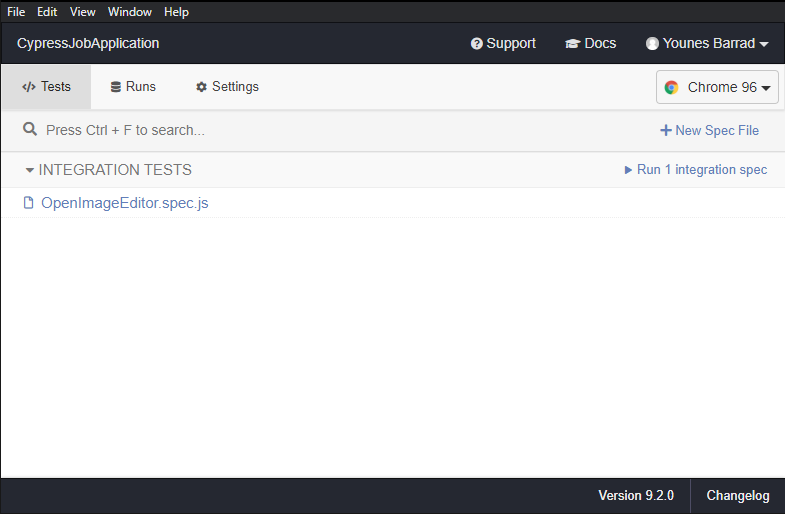

# Cypress Job Application

This is a photo upload application for a tailored t-shirt application. In this example, we will consider that a t-shirt can be customized on 2 variations:
* Color - the color of the t-shirt.
* Fabric - the type of cloth used.
* A variable number of Images can be uploaded for each combination of Color+Fabric.


## Help + Testing

The steps below will take you all the way through this repo. It is assumed you have node js installed.


### 1. Download this project

In the taskbar above, click on the "Code" button, then "Download ZIP".

Save the project folder on your computer and open the CMD inside that folder. 

Use the following commands:

```bash

## install the project
npm install

## run cypress
npm run cytest
```

### 2. Cypress Interface



you can easily run all tests just by clicking `Run integration spec` or by clicking on a specific spec file

### 3. Creating new tests

create new tests inside integration folder make sure it ends with `.spec.js`

**If you get stuck with cypress, check the documentation here:**

* [Cypress Docs](https://on.cypress.io)
